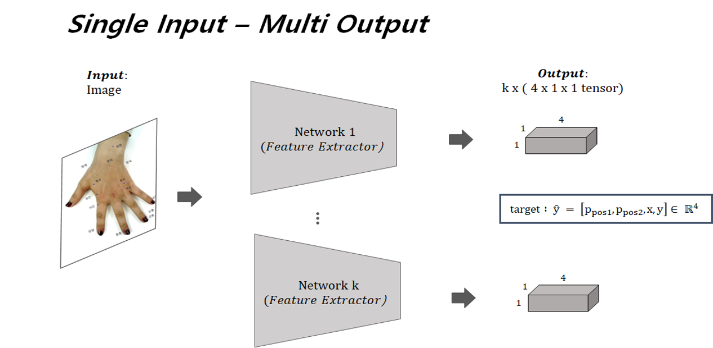
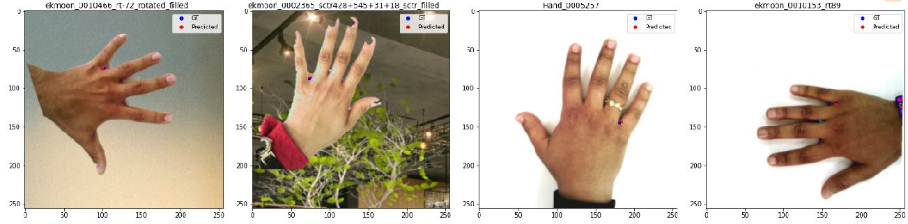

## DL Application to Predict Acupuncture Points 
#### **Overview**
    1. Input: Hand Image 
    2. CNN Feature Extractor
        - ResNet (18, 34, 50, 101,151) 
    3. Output: Target Acupuncture Coordinates
#### Data Flow

#### Fitting result

---
### Dependencies 
- Pytorch 1.6.0
- cuda
- Python 3.7 +
### 1. Downloading and Creating Dataset Folder
#### Step1. Download dataset of interest to directory `./Acu_Dataset` using the following link: 
    google drive link:
    https://drive.google.com/drive/folders/1F-lQY83tHvRy0fUVVS0hUTjJHrl00M50?usp=sharing

Dataset included in the drive: ekmoon, gwanchung, hapgok, hugye, jungjer, nogung, sangyang, shinmoon, sochung, sotack, taeyeon, urjae

#### Step2. make sure to align with the following directory structure. For instance, if `ekmoon` folder is downloaded in Acu_Dataset Folder: 
    .
    ├── Acu_Dataset
    │   ├── ekmoon
    │   │   ├── org
    │   │   │   ├── Hand_0000002.png
    │   │   │   ...
    │   │   │   └── Hand_0011628.png
    │   │   └── ekmoon_info.json
    │   ...
    ...   
    ├── checkpoints
    ├── misc
    ├── runs
    └── testdata

### 2. Augmenting Dataset
Using `IMG_Augment.ipynb`, augment dataset.

After full augmentation, the following directory structure is expected:

    .
    ├── Acu_Dataset
    │   ├── ekmoon
    │   │   ├── org
    │   │   ├── filled
    │   │   ├── rotated
    │   │   ├── rotated_filled
    │   │   ├── sctr
    │   │   ├── sctr_filled              
    │   │   └── ekmoon_info.json
    │   ...
    ...  

### 3. Training Network
To train ekmoon on resnet18 with batch size 32: 

    python main.py --kw ekmoon --model resnet18 --bs 32

or using Jupyter notebook run all cells in `Acup_train.ipynb`

To check tensorboard:

    tensorboard --logdir=runs --samples_per_plugin=images=50